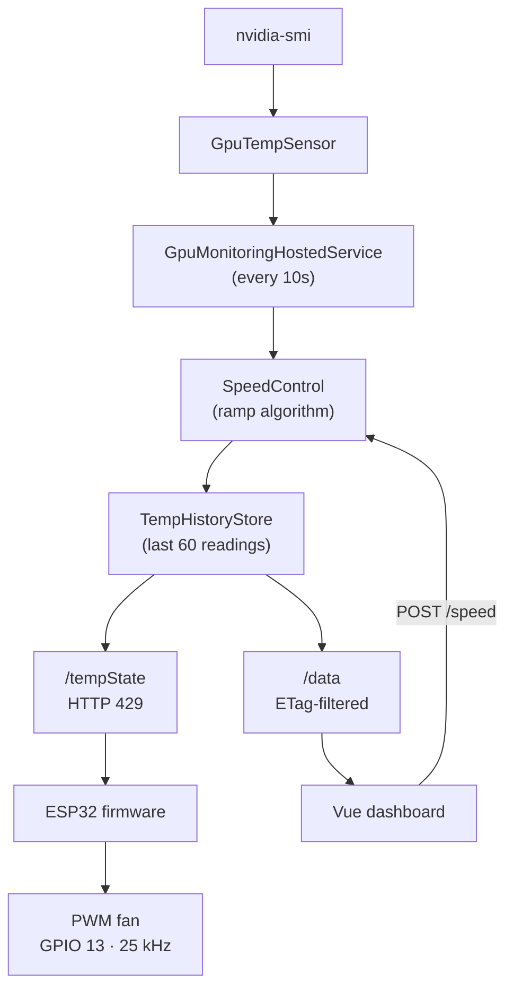

# FanRemote

GPU fan control system with three components:

- **`HttpService/`** — ASP.NET Core (.NET 10) backend that reads GPU temp via `nvidia-smi` and computes fan speed
- **`ClientApp/`** — Vue 3 + Vite frontend dashboard for monitoring and manual speed override
- **`FanControl/`** — ESP32 Arduino firmware (PlatformIO) that polls the server and drives a PWM fan

## Architecture & Data Flow



`SpeedControl` ramp algorithm (0–255 PWM range):
- Below `TempFloor` (55°C): speed = 0
- Above `TempCeiling` (85°C): speed = 255
- Between: max speed scales linearly; current speed ramps up by `StepPercentage` per interval
- The Vue speed override bypasses the algorithm entirely

`/tempState` returns HTTP 429 intentionally — the ESP32 treats this as success and parses the body as the PWM value.

`/data` uses ETags so each poll returns only readings newer than the client's last response.

## Getting Started

### 1. HttpService configuration (`appsettings.json`)

```json
"FanControlOptions": { "TempFloor": 55, "TempCeiling": 85, "StepPercentage": 2, "StepIntervalSeconds": 10 },
"NvidiaSmiOptions": { "MvidiaSmiExeLocation": "<path to nvidia-smi.exe>" },
"Kestrel": { "EndPoints": { "Http": { "Url": "http://*:6969" } } }
```

### 2. ESP32 firmware (`FanControl/src/main.cpp`)

Fill in before flashing:
- `ssid` / `password` — 2.4 GHz WiFi credentials
- `serverUrl` — e.g., `http://192.168.x.x:6969/tempState`

### 3. Build and run

Build the frontend first (output goes into `HttpService/wwwroot/`):

```bash
cd ClientApp
npm install
npm run build
```

Then run the backend:

```bash
cd HttpService
dotnet run
```

Flash the ESP32:

```bash
cd FanControl
pio run --target upload
pio device monitor   # 115200 baud
```

## VS Code

| Action | How |
|---|---|
| Build frontend + backend | `Ctrl+Shift+B` (default build task: **build All**) |
| Launch backend with debugger | `F5` (**Launch Backend**) |
| Run a specific task | `Ctrl+Shift+P` → "Tasks: Run Task" |

Available tasks:

| Task | What it does |
|---|---|
| **build All** | Saves all files → builds frontend → builds backend |
| **build Frontend** | Saves all files → `npm run build` in `ClientApp/` |
| **build Backend** | Saves all files → `dotnet build HttpService` |
| **run UI** | Builds frontend → `dotnet run --project HttpService` |

## Development

### HttpService (C#)
```bash
cd HttpService
dotnet build
dotnet run
```

### ClientApp (Vue/Vite)
```bash
cd ClientApp
npm run dev      # dev server
npm run lint     # oxlint + eslint
npm run format   # prettier
```

### FanControl (ESP32 / PlatformIO)
```bash
cd FanControl
pio run                    # build
pio run --target upload    # flash
pio device monitor         # serial monitor
```

## Service Deployment

HttpService can run as a Windows Service — it is already configured via `UseWindowsService()`.
